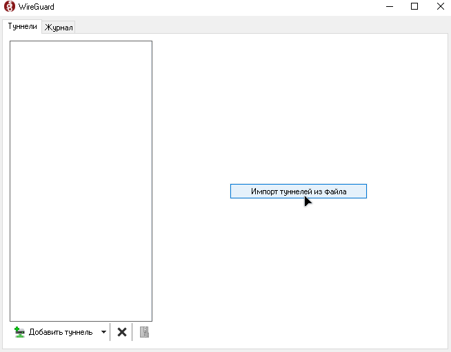

<!-- Подключаем наш кастомный CSS для темной темы -->
<link rel="stylesheet" href="/assets/style.css">

# Установка ВПН

<ul>
  <li>Скачать и установить приложение под ваше устройство по ссылке справа. 
    <a href="https://www.wireguard.com/install/">Тык сюда</a>
  </li>
  <li>Скачать файл конфигурации, который я вам отправил.</li>
  <li>Зайти в приложение и нажать кнопку "Импорт тунелей из файла".</li>
</ul>

<!-- Вставка изображения для импорта -->

<ul>
  <li>Нажать кнопку подключить.</li>
</ul>

<!-- Вставка изображения для подключения -->

<!-- Подпись -->
<footer>
  From Damir with love ❤️
</footer>

